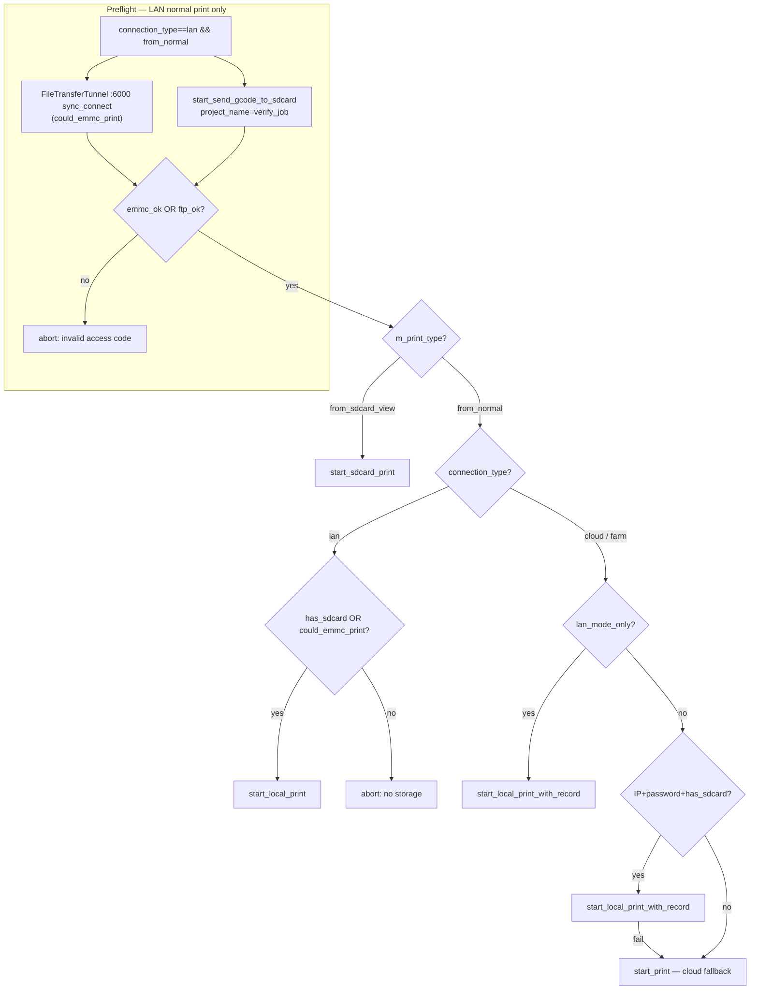

### 8.8. Submitting a print job

Studio starts a print or storage upload by filling a `PrintParams` and calling one of five `bambu_network_start_*` entry points. Typedefs and the struct live in [`bambu_networking.hpp`](https://github.com/bambulab/BambuStudio/blob/12f17b06f4f537f9c03162d08bb70cf733c42839/src/slic3r/Utils/bambu_networking.hpp#L136-L163) / [L199-250](https://github.com/bambulab/BambuStudio/blob/12f17b06f4f537f9c03162d08bb70cf733c42839/src/slic3r/Utils/bambu_networking.hpp#L199-L250); Studio resolves the symbols via `dlsym` and wraps them in [`NetworkAgent::{start_print,…}`](https://github.com/bambulab/BambuStudio/blob/12f17b06f4f537f9c03162d08bb70cf733c42839/src/slic3r/Utils/NetworkAgent.cpp#L1158-L1195). Progress / cancel / wait lambdas are **per-call** arguments — not agent-level setters ([§8.2](08.02-callbacks.md)).

Neighbors: MQTT topics / `sequence_id` ([§6.2](06.02-mqtt.md)); FTPS naming / probe ([§8.8.6](#886-bambu_network_start_send_gcode_to_sdcard)); Send-to-Printer `ft_*` ([§8.14](08.14-file-transfer.md)); `:6000` wire ([§6.4](06.04-port-6000.md)); signing / `url_enc` / HTTP PoP ([§10.3](10.03-mqtt-field-encryption.md) / [§10.4](10.04-mqtt-signing.md) / [§10.5](10.05-http-pop.md)); Studio-forwarded timelapse preflight ([§12.11](12.11-camera.md)); HTTP hosts ([§6.6](06.06-cloud-rest.md)).


| Symbol                                         | Signature                                                                                      | Notes                                      |
| ---------------------------------------------- | ---------------------------------------------------------------------------------------------- | ------------------------------------------ |
| `bambu_network_start_local_print`              | `int(void*, PrintParams, OnUpdateStatusFn, WasCancelledFn)`                                    | Pure LAN print                             |
| `bambu_network_start_local_print_with_record`  | `int(void*, PrintParams, OnUpdateStatusFn, WasCancelledFn, OnWaitFn)`                          | Hybrid / “LAN with cloud record”           |
| `bambu_network_start_print`                    | `int(void*, PrintParams, OnUpdateStatusFn, WasCancelledFn, OnWaitFn)`                          | Pure cloud print                           |
| `bambu_network_start_sdcard_print`             | `int(void*, PrintParams, OnUpdateStatusFn, WasCancelledFn)`                                    | Print file already on printer storage      |
| `bambu_network_start_send_gcode_to_sdcard`     | `int(void*, PrintParams, OnUpdateStatusFn, WasCancelledFn, OnWaitFn)`                          | FTPS upload only; no MQTT print command    |


#### 8.8.1. Common contract

**Callback typedefs** ([bambu_networking.hpp:136-138](https://github.com/bambulab/BambuStudio/blob/12f17b06f4f537f9c03162d08bb70cf733c42839/src/slic3r/Utils/bambu_networking.hpp#L136-L138)):

```cpp
using OnUpdateStatusFn = std::function<void(int status, int code, std::string msg)>;
using WasCancelledFn   = std::function<bool()>;
using OnWaitFn         = std::function<bool(int status, std::string job_info)>;
```

`status` is a `SendingPrintJobStage` value. `OnWaitFn` appears in the ABI for `start_print`, `start_local_print_with_record`, and `start_send_gcode_to_sdcard`; Studio uses it for the two cloud-facing **print** paths only.

**`SendingPrintJobStage`** ([bambu_networking.hpp:153-163](https://github.com/bambulab/BambuStudio/blob/12f17b06f4f537f9c03162d08bb70cf733c42839/src/slic3r/Utils/bambu_networking.hpp#L153-L163)) — first argument of `OnUpdateStatusFn` / `OnWaitFn`. Unchanged across snapshots `02.03.00` … `02.08.01`:

| Value | Enumerator | Typical use |
| ---: | --- | --- |
| `0` | `PrintingStageCreate` | Job / cloud project create |
| `1` | `PrintingStageUpload` | Model / config body upload (FTPS, S3, `:6000`) |
| `2` | `PrintingStageWaiting` | Waiting on cloud / printer readiness |
| `3` | `PrintingStageSending` | MQTT / cloud dispatch in progress |
| `4` | `PrintingStageRecord` | Cloud history / record step |
| `5` | `PrintingStageWaitPrinter` | Waiting for printer ack / `job_id` |
| `6` | `PrintingStageFinished` | Success terminal (Studio expects `code=0`, `msg` = elapsed seconds string) |
| `7` | `PrintingStageERROR` | Failure terminal |
| `8` | `PrintingStageLimit` | Quota / rate-limit style failure |

**`PrintParams`** ([bambu_networking.hpp:199-250](https://github.com/bambulab/BambuStudio/blob/12f17b06f4f537f9c03162d08bb70cf733c42839/src/slic3r/Utils/bambu_networking.hpp#L199-L250)) — passed **by value**; field order and presence are part of the C++ ABI. MQTT mapping: [project_file payload](#mqtt-project_file-payload). Cloud REST bodies: Plugin behaviour of [§8.8.3](#883-bambu_network_start_local_print_with_record) / [§8.8.4](#884-bambu_network_start_print).

**Since** = first networking ABI series in [`tools/abi_snapshot/`](../tools/abi_snapshot/) where the member appears in `bambu_networking.hpp` (series gate is the first three version components, e.g. `02.05.03`). Fields without a Since column were already present in the oldest snapshot (`02.03.00`). Adding a member changes `sizeof(PrintParams)` — a plugin built for an older series must not assume later fields exist.

| Field | Type | Default | Since | Meaning |
| --- | --- | --- | --- | --- |
| `dev_id` | `std::string` | — | | Printer serial / device id |
| `task_name` | `std::string` | — | | Human task label; also MQTT `subtask_name` fallback for `pick_remote_name` |
| `project_name` | `std::string` | — | | Remote object / display name; FTPS STOR name for [§8.8.6](#886-bambu_network_start_send_gcode_to_sdcard) (`"verify_job"` = write probe only) |
| `preset_name` | `std::string` | — | | Process / filament preset label (cloud / history) |
| `filename` | `std::string` | — | | Local path of the print-ready `.3mf` (or probe file) |
| `config_filename` | `std::string` | — | | Local path of the small config/history `.3mf` (cloud paths) |
| `plate_index` | `int` | — | | Plate number → MQTT `param` = `Metadata/plate_N.gcode` |
| `ftp_folder` | `std::string` | — | | FTPS directory; Studio usually leaves empty (upload to root) |
| `ftp_file` | `std::string` | — | | Optional remote FTPS object name override |
| `ftp_file_md5` | `std::string` | — | | MD5 of uploaded body when precomputed |
| `nozzle_mapping` | `std::string` | — | | Nozzle index mapping string for multi-nozzle jobs |
| `ams_mapping` | `std::string` | — | | Compact AMS slot list → MQTT `ams_mapping` JSON array |
| `ams_mapping2` | `std::string` | — | | Structured AMS map → MQTT `ams_mapping2` |
| `ams_mapping_info` | `std::string` | — | | Rich AMS detail JSON for cloud `amsDetailMapping` — **not** copied into LAN `project_file` |
| `nozzles_info` | `std::string` | — | | Nozzle metadata JSON for cloud / diagnostics — **not** in LAN `project_file` |
| `connection_type` | `std::string` | — | | Studio connection class (`lan` / `cloud` / …); gates which entry point is chosen |
| `comments` | `std::string` | — | | Free-form comment for cloud task — **not** in LAN `project_file` |
| `origin_profile_id` | `int` | `0` | | MakerWorld / cloud profile id |
| `stl_design_id` | `int` | `0` | | MakerWorld design id |
| `origin_model_id` | `std::string` | — | | Cloud / MakerWorld model id string |
| `print_type` | `std::string` | — | | e.g. `from_sdcard_view` selects `start_sdcard_print` |
| `dst_file` | `std::string` | — | | Path already on printer storage (`file:///` / sdcard print) |
| `dev_name` | `std::string` | — | | Display name of the printer |
| `dev_ip` | `std::string` | — | | LAN IP (FTPS / `:6000` / LAN MQTT) |
| `use_ssl_for_ftp` | `bool` | — | | Prefer FTPS vs plain FTP |
| `use_ssl_for_mqtt` | `bool` | — | | Prefer MQTTS vs plain MQTT on LAN |
| `username` | `std::string` | — | | LAN login (normally `bblp`) |
| `password` | `std::string` | — | | LAN access code |
| `task_bed_leveling` | `bool` | — | | → MQTT `bed_leveling` |
| `task_flow_cali` | `bool` | — | | → MQTT `flow_cali` |
| `task_vibration_cali` | `bool` | — | | → MQTT `vibration_cali` |
| `task_layer_inspect` | `bool` | — | | → MQTT `layer_inspect` |
| `task_record_timelapse` | `bool` | — | | → MQTT `timelapse` |
| `task_timelapse_use_internal` | `bool` | — | **`02.05.03`** | Timelapse to internal storage → MQTT `cfg` bit `0x4` (`"4"` / `"0"`). Absent before this series ⇒ stock always emits `cfg="0"` |
| `task_use_ams` | `bool` | — | | → MQTT `use_ams` |
| `task_bed_type` | `std::string` | — | | → MQTT `bed_type` (e.g. `textured_plate`) |
| `extra_options` | `std::string` | — | | Opaque Studio extras for cloud — **not** in LAN `project_file` |
| `auto_bed_leveling` | `int` | `0` | | → MQTT `auto_bed_leveling` |
| `auto_flow_cali` | `int` | `0` | | → MQTT `extrude_cali_flag` (`0`/`1`/`2`, not a pure bool) |
| `auto_offset_cali` | `int` | `0` | | → MQTT `nozzle_offset_cali` |
| `extruder_cali_manual_mode` | `int` | `-1` | **`02.04.00`** | → MQTT `extrude_cali_manual_mode` only when `!= -1` (sentinel omits the wire field). Note MQTT spelling `extrude_*` vs ABI `extruder_*` |
| `task_ext_change_assist` | `bool` | — | | External-spool change assist — cloud / diagnostics; **not** in LAN `project_file` |
| `try_emmc_print` | `bool` | — | | Studio sets from `could_emmc_print` / brtc capability; does **not** alone select model transport (stock picks by entry point — table below). **Not** in LAN `project_file` |
| `svc_context` | `std::string` | — | **`02.07.01`** | Optional MakerWorld / model metadata (`BBL_SVC_CONTEXT_TAG`); Studio copies when present (`PrintJob.cpp`) |
| `slicer_uid` | `std::string` | — | **`02.08.01`** | Slicer instance uid field on the ABI surface. **TODO**: need confirmation of Studio write sites and stock consumption (header-only in pin `12f17b06` tree search) |

Notable Studio values: `project_name="verify_job"` is only a probe filename ([§8.8.6](#886-bambu_network_start_send_gcode_to_sdcard)); `print_type=="from_sdcard_view"` sets `dst_file` and selects `start_sdcard_print`; `ftp_folder` is usually empty (stock uploads to FTPS root).

**Return convention.** `int`: `0` on success. Cancel when `cancel_fn()` is true → `BAMBU_NETWORK_ERR_CANCELED` (−18) ([§8.16](08.16-errors.md)). Studio also treats other negatives / `update_fn` with `stage==ERROR` or `code` outside 0–100 as failure. Success UX expects `update_fn(PrintingStageFinished, 0, "<seconds>")` (stock uses `"3"`).

Signing / field encryption for MQTT on non–Developer Mode firmware: [§10.3](10.03-mqtt-field-encryption.md) / [§10.4](10.04-mqtt-signing.md). Cloud upload HTTPS PoP: [§10.5](10.05-http-pop.md).

**Stock model transport by ABI entry point** (wire-confirmed P2S, 2026-07). Studio sets `try_emmc_print = could_emmc_print` the same way for every print path; that flag alone does **not** select the model body transport — stock picks by entry point:

| Entry | Cloud HTTPS | LAN model upload (stock) | Winning model URL / who prints |
|---|---|---|---|
| `start_local_print` | none | Full `.3mf` over **TLS `:6000` (brtc)** | LAN MQTT `project_file` with `brtc://emmc/<name>` — only honest LAN path |
| `start_local_print_with_record` | Config + **full** `.3mf` to S3; two project PATCHes (`ftp://` then **https S3**) | Full `.3mf` over **FTPS `:990` only** (never brtc) | Cloud `/my/task` `mode=lan_file` → printer **re-downloads S3** |
| `start_print` | Config + full `.3mf` to S3; PATCH → S3 | none | Cloud `/my/task` `mode=cloud_file` → S3 download |

##### MQTT `project_file` payload

Used by **`start_local_print`** and **`start_sdcard_print`** (plugin builds the frame). Cloud `/my/task` paths must **not** also publish this command on the same start. Topics / `sequence_id` assignment: [§6.2](06.02-mqtt.md).

The print-job submission ends with a single MQTT command published to the printer's request channel (`device/<dev_id>/request` on LAN, identical envelope on the cloud forwarder). The frame the firmware actually parses lives under the `print` object. The example below was captured on a real P2S running stock firmware paired with the stock Studio + plugin; X1 / P1S share the schema with a few extra optional members.

```json
{
  "print": {
    "sequence_id":             "1749823456789",
    "command":                 "project_file",
    "param":                   "Metadata/plate_1.gcode",
    "project_id":              "0",
    "profile_id":              "0",
    "task_id":                 "0",
    "subtask_id":              "0",
    "subtask_name":            "test",
    "file":                    "test.gcode.3mf",
    "url_enc":                 "bcXiq4/uHGqgb4DXVihrpQOR…",
    "md5":                     "7947606528CE6E00219496B51D5D13D1",
    "bed_type":                "textured_plate",
    "bed_leveling":            false,
    "flow_cali":               false,
    "vibration_cali":          false,
    "layer_inspect":           true,
    "timelapse":               true,
    "use_ams":                 true,
    "ams_mapping":             [3,-1,-1],
    "ams_mapping2":            [{"ams_id":0,"slot_id":3},{"ams_id":255,"slot_id":255},{"ams_id":255,"slot_id":255}],
    "auto_bed_leveling":       0,
    "cfg":                     "4",
    "extrude_cali_flag":       0,
    "extrude_cali_manual_mode":0,
    "nozzle_offset_cali":      2
  }
}
```

| Field | Type | Source in `PrintParams` (Studio -> ABI) | Notes |
|---|---|---|---|
| `sequence_id` | string (decimal) | See [§6.2](06.02-mqtt.md#mqtt-sequence_id) | Per-command unique id; the printer echoes it on the matching ack |
| `command` | string | constant `"project_file"` | Selects the firmware handler. |
| `param` | string | derived from `plate_index` | Always `Metadata/plate_<N>.gcode`; resolves to a path inside the uploaded 3mf. |
| `project_id`, `profile_id`, `task_id`, `subtask_id` | strings | cloud task IDs from `POST /v1/user-service/my/task` (cloud) or `"0"` placeholder (LAN / Developer Mode) | Sent as **strings**, not numbers. |
| `subtask_name` | string | `project_name` (falls back to `task_name`) | Shown on the printer screen. |
| `file` | string | `opts.file_path` | Basename or path of the `.3mf` on the printer side. Usually mirrors the trailing segment of `url` (without the scheme). See **URL schemes** below. |
| `url` / `url_enc` | string | `opts.url` | Tells firmware **how to locate** the `.3mf`. Cleartext `url` uses one of several schemes (`ftp://`, `brtc://emmc/`, `file://`, presigned `https://…` for cloud); `url_enc` is the same URL RSA-encrypted with the **printer's device-cert public key** using **PKCS#1 v1.5** padding (direct RSA, no AES session-key wrap — the observed ≤~245-byte ciphertext equals the RSA-2048 PKCS#1 v1.5 ceiling of `256−11=245` and rules out OAEP-SHA1, which would cap at 214; independently cross-validated in [issue #47](https://github.com/ClusterM/open-bamboo-networking/issues/47), on-wire confirmation of the padding still pending). Non-Developer-Mode firmware requires `url_enc`; Developer Mode accepts plain `url`. Full scheme semantics: see **URL schemes** below. |
| `md5` | string | `opts.md5` (uppercase hex) | Printer cross-checks the 3mf integrity before slicing it. |
| `bed_type` | string | `task_bed_type` (defaults to `"auto"`) | One of the `MachineBedTypeString` values. |
| `bed_leveling`, `flow_cali`, `vibration_cali`, `layer_inspect`, `timelapse`, `use_ams` | bool | matching `task_*` flags | Per-print toggles from the `SelectMachineDialog` checkboxes. |
| `ams_mapping` | int array | `ams_mapping` (Studio passes a JSON array string `[0,-1,...]`) | Index = filament slot in the 3mf, value = AMS tray id (`-1` = no mapping, `255` = virtual tray). Legacy single-AMS shape. |
| `ams_mapping2` | object array | `ams_mapping2` (Studio passes a JSON-array string of `{ams_id, slot_id}` objects) | Newer multi-AMS schema, one entry per filament. `255/255` means "external spool / not via AMS". Required for printers with >1 AMS unit; firmware that supports both fields prefers `ams_mapping2` over `ams_mapping`. **Note:** cloud `POST /my/task` uses a *different* AMS serialization (camelCase / external-spool sentinel) — see [§8.8.3](#883-bambu_network_start_local_print_with_record). |
| `nozzle_mapping` | int array | `nozzle_mapping` (Studio passes a JSON-array string of ints, e.g. `"[0,1]"`) | Index = filament slot in the 3mf, value = physical nozzle/extruder position id. **Emitted only on multi-extruder printers** — Studio gates every assignment to `task_nozzle_mapping` on `MachineObject::GetNozzleRack()->IsSupported()` (see `SelectMachine.cpp:3107` and `CalibUtils.cpp:2225`/`2358`), so on single-nozzle hardware (P2S, X1C, A1, etc.) the field is omitted entirely from `project_file`. The Studio-side value is sourced verbatim from the printer's reply to the `get_auto_nozzle_mapping` MQTT query (`DevMappingNozzle.cpp:277-282` deserialises the `mapping` field into `std::vector<int>`), so the type is **always** a flat `int` array — no objects, no string-wrapped numbers, no `[0,-1,…]` sentinels analogous to `ams_mapping`. Stock-plugin observation: when Studio hands it a string with whitespace (e.g. `"[0,1, 2]"`), the stock plugin re-emits it as canonical `"[0,1,2]"`; this normalization is cosmetic and not required for firmware acceptance. |
| `auto_bed_leveling` | int | `auto_bed_leveling` | Bed-leveling option as an int (0 = off, 1 = on, 2 = auto). Coexists with the boolean `bed_leveling`: the boolean is the user toggle, the int is the resolved policy after taking firmware capabilities into account. |
| `nozzle_offset_cali` | int | `auto_offset_cali` (**name mismatch is intentional in upstream**) | Nozzle-offset calibration option (0 = off, 2 = auto). |
| `extrude_cali_manual_mode` | int | `extruder_cali_manual_mode` (**`extrude` vs `extruder` asymmetry is intentional in upstream**) | PA calibration mode (0 = automatic, 1 = manual). **Field is gated on the value, not the ABI** — the stock plugin emits it only when `extruder_cali_manual_mode != -1` (the `PrintParams` default). With the default sentinel it is omitted entirely from `project_file`. Confirmed across ABI `02.05.00`, `02.05.03`, `02.06.01`. |
| `cfg` | string (decimal int) | derived from `task_timelapse_use_internal` (other bits unknown) | Bitmask the stock plugin builds from `PrintParams` flags that don't have a dedicated MQTT field. **Bit 2 (`0x4`) = use internal storage for timelapse**, driven by `task_timelapse_use_internal` (`task_timelapse_use_internal=true` -> `"4"`, `false` -> `"0"`). Always emitted as a string, not a number. **Field is present in `project_file` for *every* observed ABI from `02.05.00` upwards** — but on builds older than `02.05.03` (where `PrintParams::task_timelapse_use_internal` does not exist yet) the value is permanently `"0"` and the plugin has no way to surface a `"4"`. Cross-ABI confirmation: `02.05.00`/`02.05.01`/`02.05.02` always emit `cfg="0"`; `02.05.03`/`02.06.00`/`02.06.01` emit `cfg="4"` when `task_timelapse_use_internal=true` and `cfg="0"` otherwise. **`task_record_timelapse` does NOT influence `cfg`** — only the `timelapse` boolean in the same payload. No other bit values have been observed in the wild yet — a future capture showing e.g. `"1"`, `"2"` or `"5"` would identify another flag's meaning. |
| `extrude_cali_flag` | int | derived from `auto_flow_cali` | Stock-plugin-only field present in every observed `project_file`. **The value is taken straight from `PrintParams::auto_flow_cali`** and is a **multi-valued enum, not a bool**: `0` = off, `1` = requested, and `2` (= auto) has been observed in genuine traffic ([issue #48](https://github.com/ClusterM/open-bamboo-networking/issues/48)); further values may exist. Captured Studio sessions almost always ship `auto_flow_cali=0`, which is why the field looks hardcoded at first glance. Likely a "PA cali requested" guard the firmware uses to short-circuit redundant calibration runs. |

###### Cloud-start extras in `project_file` (verify on stock firmware)

The **cloud** variant of `project_file` (job started through `/my/task`, not LAN) carries extra fields beyond the table above, per genuine captures cross-validated in [issue #48](https://github.com/ClusterM/open-bamboo-networking/issues/48):

- `job_id` — **int** (unlike `task_id`/`subtask_id`, which are strings), echoing the id minted by `POST /v1/user-service/my/task`;
- `job_type: 1` — constant in observed cloud starts;
- `design_id` — the MakerWorld design id when the print originates from a downloaded model (`0`/absent otherwise);
- a trailing `"reason":"success","result":"success"` pair — present in the *published command* itself in some captures (not only in the printer's ack echo).

Whether stock firmware requires these extras on cloud-started jobs (or silently tolerates their absence) still needs verification on hardware.

###### URL schemes for model location (`file` / `url`)

The MQTT command is always `project_file`; there is **no** separate `storage: emmc|udisk` field that selects where the model lives. Instead, firmware interprets the **`url` prefix** (and the matching `file` basename/path). Observed / reverse-engineered on **P2S** (May 2026):

| URL prefix | Example | Firmware behaviour (inferred) |
|---|---|---|
| `ftp://` | `ftp://skadis_spool-Body.gcode.3mf` | **FTPS / sdcard-style volume**, and one of the two URL schemes cloud dispatch appears to accept (with `https://`). Stock `_with_record` briefly PATCHes this, then **overwrites** with S3 https ([§8.8.3](#883-bambu_network_start_local_print_with_record)). Older N7-class pure-LAN FTPS legs use it for real. A `:6000` cache file of the same name does **not** satisfy `ftp://`. |
| `ftp:///` (three slashes) | `ftp:///skadis_spool-Body.gcode.3mf` | **Offline / pre-pushed variant of the row above, not a defect.** Genuine traffic shows both spellings and they are **scenario-dependent**: two slashes when the plugin has just FTPS-uploaded the file, three slashes (empty authority = "local", absolute path) when the file was pushed to the printer earlier and the job starts offline against the already-present copy. Firmware accepts both. Cross-validated in [issue #48](https://github.com/ClusterM/open-bamboo-networking/issues/48). |
| `brtc://emmc/` | `brtc://emmc/skadis_spool-Body.gcode.3mf` | **LAN MQTT model-cache lookup** after `:6000` `cmdtype=5`. Stock P2S **`start_local_print`** and Send-to-Printer use this. **Not** used on stock `_with_record` / `start_print`; cloud `/my/task` path shows no support for registering or dispatching `brtc://` ([§8.8.3](#883-bambu_network_start_local_print_with_record)). Despite the `emmc` token, firmware searches udisk cache then emmc ([§6.4](06.04-port-6000.md)). |
| `file://` | `file:///media/usb0/cache/skadis_spool-Body.gcode.3mf` | **Explicit filesystem path.** No cache heuristics — open exactly that file. Typical for **Print from Device** when the `.3mf` is already on storage. Paths observed under `/media/usb0/` with or without a `/cache/` segment (e.g. `file:///media/usb0/skadis_spool-Body.gcode.3mf`). |
| `https://` | presigned object URL | **Cloud print.** Printer downloads from Bambu object storage; unrelated to local emmc/udisk caches. |

**Upload vs print-start:** choosing Cache vs External in Send to Printer sets `dest_storage` (`"emmc"` / `"udisk"`) in the `:6000` `cmdtype=5` upload ([§6.4](06.04-port-6000.md) / [§8.14](08.14-file-transfer.md)) — that decides **where the file is written** in the model cache. The `url` scheme at print-start decides **how firmware finds** the file afterward (`brtc://emmc/` = search both caches; `ftp://` = FTPS volume; `file://` = fixed path). Hybrid stock print writes via FTPS and starts with `ftp://` — not via the Send-to-Printer cache path ([§8.8.3](#883-bambu_network_start_local_print_with_record)).

**Not model storage:** the `cfg` bitmask (`"4"` when `task_timelapse_use_internal=true`) and the `ipcam_get_media_info` preflight ([§12.11](12.11-camera.md)) govern **timelapse video recording** destination, not which `.3mf` is printed.

Sibling `header` object the stock plugin wraps the command in (cloud and LAN alike when paired against signature-checking firmware):

Field encryption (`url_enc`): [§10.3](10.03-mqtt-field-encryption.md). MQTT signing: [§10.4](10.04-mqtt-signing.md). HTTP PoP: [§10.5](10.05-http-pop.md). Trust / provisioning: [§10.2](10.02-secrets.md#provisioning-printer-trust-store). App-cert fetch: [§10.2](10.02-secrets.md).

###### Cross-ABI `project_file` reverse-engineering matrix

The mapping above was verified by loading the stock `libbambu_networking.so` of each version below into a `BBL::PrintParams`-driven harness and capturing the resulting LAN MQTT `project_file` payload against an N7 in Developer Mode:

| ABI tag | Plugin file | `cfg` baseline behaviour | New schema field(s) vs the prior tag |
|---|---|---|---|
| `02.05.00` | `02.05.00.56` | always `"0"` | (reference) |
| `02.05.01` | `02.05.01.52` | always `"0"` | none |
| `02.05.02` | `02.05.02.58` | always `"0"` | none |
| `02.05.03` | `02.05.03.63` | `"4"` if `task_timelapse_use_internal=true`, else `"0"` | `cfg` becomes settable (the `PrintParams::task_timelapse_use_internal` ABI break) |
| `02.06.00` | `02.06.00.50` | same as `02.05.03` | none in `project_file`; only new exports are filament-spool CRUD (`bambu_network_get_filament_spools`, `bambu_network_create_filament_spool`, `bambu_network_update_filament_spool`, `bambu_network_delete_filament_spools`, `bambu_network_get_filament_config`) — those are HTTP plumbing, not LAN MQTT |
| `02.06.01` | `02.06.01.50` | same as `02.05.03` | none |

**Bottom line:** the on-the-wire `project_file` schema is essentially frozen across `02.05.x` -> `02.06.x`. The only ABI-significant change for LAN print submission is the addition of `task_timelapse_use_internal` in `02.05.03`, which feeds the `cfg` bitmask (and only bit `0x4` has been observed so far). All field mappings below were also confirmed identical between `02.05.00` and `02.06.01` — only the `cfg` value differs between the two ABI families.

###### Per-`PrintParams`-field mapping (overlay matrix on ABI `02.05.03`)

The following matrix was collected by toggling one `PrintParams` field at a time before handing the struct to the stock plugin and diffing the resulting `project_file` against an all-defaults baseline. It confirms — and in some cases corrects — the per-row notes in the table above.

| `PrintParams` field overridden | Resulting `project_file` change |
|---|---|
| `task_use_ams=true`, `ams_mapping="[0]"`, `ams_mapping2='[{"ams_id":0,"slot_id":0}]'` | `use_ams: false → true`, `ams_mapping: [] → [0]`, `ams_mapping2: [] → [{"ams_id":0,"slot_id":0}]` |
| `task_record_timelapse=false` (and `task_timelapse_use_internal=false`) | `timelapse: true → false`, `cfg: "4" → "0"` |
| `task_timelapse_use_internal=false` (alone) | `cfg: "4" → "0"` (the `timelapse` boolean stays `true`) |
| `task_bed_type="textured_plate"` | `bed_type: "auto" → "textured_plate"` |
| `task_bed_type="supertack_plate"` | `bed_type: "auto" → "supertack_plate"` |
| `task_bed_leveling=false`, `task_flow_cali=false`, `task_vibration_cali=false`, `task_layer_inspect=false` | All four matching booleans flip to `false` (`bed_leveling`, `flow_cali`, `vibration_cali`, `layer_inspect`) — direct one-to-one mapping |
| `extruder_cali_manual_mode=0` | `extrude_cali_manual_mode` **appears** with value `0` (absent in baseline because `-1` is the default) |
| `extruder_cali_manual_mode=1` | `extrude_cali_manual_mode` appears with value `1` |
| `auto_offset_cali=2` | `nozzle_offset_cali: 0 → 2` (note the upstream rename) |
| `auto_bed_leveling=2` | `auto_bed_leveling: 0 → 2` (coexists with the `bed_leveling` boolean) |
| `auto_flow_cali=1` | `extrude_cali_flag: 0 → 1` (this is how the previously mysterious `extrude_cali_flag` is populated) |
| `project_name="my-print"` | `subtask_name`, `file`, and `url` all switch in lock-step (`<project_name>`, `<project_name>.gcode.3mf`, `ftp://<project_name>.gcode.3mf`) — the FTP upload path follows suit |
| `plate_index=2` | `param: "Metadata/plate_1.gcode" → "Metadata/plate_2.gcode"` |

Fields that did **not** appear on this hardware (P2S/N7 single-extruder) regardless of overrides: `nozzle_mapping` (gated on multi-extruder, see the dedicated row above), `url_enc` (Developer Mode bypasses the encrypted-URL requirement), and the entire `header` envelope (Developer Mode disables signature verification — see [§10.4](10.04-mqtt-signing.md)).

##### Studio call selection (bonus — does not change the plugin ABI)

Studio chooses which `bambu_network_start_*` symbol to call. The plugin implements each symbol independently; it does not re-run this tree.

**UI → worker.** Slice→Print / Device→Files→Print → `PrintJob`. Send to Printer → `ft_*` when `is_support_brtc` ([§8.14](08.14-file-transfer.md)), else rare `SendJob` → `start_send_gcode_to_sdcard`. Access-code probe → `start_send_gcode_to_sdcard` with `project_name="verify_job"` ([§8.8.6](#886-bambu_network_start_send_gcode_to_sdcard)). Capability bitmaps that gate UI: [§12.1](12.01-status.md).

**`PrintJob::process()` decision tree** (`PrintJob.cpp:149-624`):



`connection_type` is the printer’s mode advertisement (SSDP `devconnect.bambu.com` → `connect_type`), **not** “LAN reachable”: `"lan"` → `start_local_print`; `"cloud"` → prefer `_with_record` when IP+code+storage exist, else `start_print`; `"farm"` treated like LAN for path selection.

**Before `PrintJob` (no print ABI):** export plate `.3mf`; export config `.3mf` for non-LAN; AMS/nozzle MQTT queries into `PrintParams`; optional timelapse storage check via `send_message*` ([§12.11](12.11-camera.md)).

**Callback UX Studio expects** (`PrintJob.cpp:405-548`): `update_fn` drives the progress bar (`Create=20%` … `Finished=100%`; Upload/Record sub-percent from `code` 0–100). `wait_fn` is used only for `start_print` / `_with_record` (poll `job_id` / print status). Pure LAN navigates away on `Finished` alone. Ongoing telemetry after submit uses `push_status` / other ABIs — not `start_*`.

LAN MQTT for `project_file` is on an **already-connected** session (`connect_printer` is outside `PrintJob`). A cloud-paired printer may still have a live LAN session ([§6.2](06.02-mqtt.md), [§10.6](10.06-lan-tls-and-access-codes.md)).


#### 8.8.2. `bambu_network_start_local_print`

**Parameters.**

| Name | Type | Meaning |
| --- | --- | --- |
| `agent` | `void*` | Opaque agent from `create_agent`. |
| `params` | `PrintParams` | Job description (by value); LAN credentials + local `filename`. |
| `update_fn` | `OnUpdateStatusFn` | Progress / stage callback (`SendingPrintJobStage`). |
| `cancel_fn` | `WasCancelledFn` | Poll for user cancel; abort with `BAMBU_NETWORK_ERR_CANCELED`. |

**Purpose.** Start a pure LAN print: deliver the plate `.3mf` to the printer over the LAN channel and publish MQTT `project_file`. No cloud `/my/task`.

**Studio.** `PrintJob` when `connection_type=="lan"` and `print_type=="from_normal"`, after LAN preflight ([Studio call selection](#studio-call-selection-bonus-does-not-change-the-plugin-abi)). Wrappers: [NetworkAgent.cpp:1185-1190](https://github.com/bambulab/BambuStudio/blob/12f17b06f4f537f9c03162d08bb70cf733c42839/src/slic3r/Utils/NetworkAgent.cpp#L1185-L1190). No `OnWaitFn` in the ABI.

**Plugin behaviour.** On an **already-connected** LAN MQTT session (`connect_printer` is outside this call):

1. Upload the full print-ready `.3mf` on LAN. Stock on P2S (wire-confirmed): TLS **`:6000` / brtc** (`cmd_type=5`), then MQTT URL `brtc://emmc/<name>`. Older N7-class path: FTPS `:990` + `ftp://`. See [transport table](#881-common-contract).
2. Publish MQTT `project_file` with `"0"` cloud id placeholders and the chosen URL scheme — [payload](#mqtt-project_file-payload). `sequence_id`: [§6.2](06.02-mqtt.md#mqtt-sequence_id).
3. Drive `update_fn` through Upload → Sending → Finished; honor `cancel_fn`.

Do **not** call `POST /my/task`. Do **not** dual-start via cloud MQTT `project_file` after a cloud path.

**Return.** `0` on success; negative on failure / cancel.

#### 8.8.3. `bambu_network_start_local_print_with_record`

**Parameters.**

| Name | Type | Meaning |
| --- | --- | --- |
| `agent` | `void*` | Opaque agent from `create_agent`. |
| `params` | `PrintParams` | Job description; typically cloud-typed device with LAN IP/code present. |
| `update_fn` | `OnUpdateStatusFn` | Progress / stage callback. |
| `cancel_fn` | `WasCancelledFn` | Cancel poll. |
| `wait_fn` | `OnWaitFn` | After task create, wait for printer `job_id` / status. |

**Purpose.** Hybrid / “LAN with cloud record” print path for cloud-paired printers when Studio has LAN credentials and storage.

**Studio.** `PrintJob` cloud/farm branch when IP + password + storage (or `lan_mode_only`) — [Studio call selection](#studio-call-selection-bonus-does-not-change-the-plugin-abi). On return `< 0`, Studio may call `start_print` as its own fallback. Wrappers: [NetworkAgent.cpp:1170-1176](https://github.com/bambulab/BambuStudio/blob/12f17b06f4f537f9c03162d08bb70cf733c42839/src/slic3r/Utils/NetworkAgent.cpp#L1170-L1176).

**Plugin behaviour.** Despite the name, stock is **not** an honest LAN-only print (P2S, Studio/plugin ~02.08; also 02.04 — MITM + LAN pcap, 2026-07): the printer **re-downloads from S3** after `/my/task`. Observed order:

1. `POST /v1/iot-service/api/user/project` `{"name":"<job>"}` → `project_id`, `model_id`, `profile_id`, first presigned `upload_url`, `upload_ticket`.
2. `PUT <upload_url>` — small **config/profile** `.3mf` (`export_config_3mf`). Omit `Content-Type` on presigned PUTs (presigner signs empty Content-Type; adding one → `403 SignatureDoesNotMatch`). Print-upload URLs are **S3 SigV2** query-auth; the cloud presigns — client does not recompute the signature.
3. `PUT /v1/iot-service/api/user/notification` + poll `GET …/notification?action=upload&ticket=…` until success.
4. **LAN FTPS `:990`** — full print-ready `.3mf` `STOR` (stock never uses `:6000`/brtc on this ABI).
5. `PATCH …/user/project/<pid>` — first register, e.g. `{"profile_id":"…","profile_print_3mf":[{"md5":"…","plate_idx":1,"url":"ftp://….gcode.3mf"}]}`.
6. `GET /v1/iot-service/api/user/upload?models=<model_id>_<profile_id>_<plate>.3mf` → second presigned URL.
7. `PUT <second URL>` — **full** `.3mf` to S3 again (same Content-Type rule).
8. `PATCH …/user/project/<pid>` — second register with **https S3** URL (wins; early `ftp://` PATCH has no lasting effect).
9. `POST /v1/user-service/my/task` with `mode":"lan_file"` — cloud dispatches; printer re-downloads S3.

**`/my/task` authorization.** Beyond `Authorization: Bearer`: mandatory `X-BBL-Client-Name: BambuStudio` + matching `X-BBL-OS-Type` ([§6.6](06.06-cloud-rest.md)); for secured printers also `x-bbl-app-certification-id` / `x-bbl-device-security-sign` ([§10.5](10.05-http-pop.md)). Treat non-2xx as fatal (do not continue with `task_id=0`).

**`amsDetailMapping[]` element** (plus camelCase `amsMapping`/`amsMapping2`; external-spool sentinel `{amsId:255,slotId:0}` — [issue #48](https://github.com/ClusterM/open-bamboo-networking/issues/48)):

```json
{
  "ams": 0,
  "filamentId": "GFA00",
  "filamentType": "PLA",
  "nozzleId": 0,
  "sourceColor": "#FFFFFFFF",
  "targetColor": "#FFFFFFFF"
}
```

Colors are RGBA hex with leading `#`. Source data: `PrintParams::ams_mapping_info`.

Do **not** publish LAN MQTT `project_file` for the start (duplicate job → `0500_4004`). Preserve **exactly one `/my/task` per user action** — if this entry point creates the cloud task, return `0`; failing after `/my/task` triggers Studio’s `start_print` fallback and a second task. Cloud-dispatched project URLs appear limited to `https://…` and `ftp://…` (not `brtc://`). Skipping the small config upload still starts the print but leaves Print History without a thumbnail — stock always does step 2–3.

**Return.** `0` on success; negative on failure / cancel. Studio may fall back to `start_print` when `< 0`.

#### 8.8.4. `bambu_network_start_print`

**Parameters.**

| Name | Type | Meaning |
| --- | --- | --- |
| `agent` | `void*` | Opaque agent from `create_agent`. |
| `params` | `PrintParams` | Job description; includes `config_filename` for the small history/preview `.3mf`. |
| `update_fn` | `OnUpdateStatusFn` | Progress / stage callback. |
| `cancel_fn` | `WasCancelledFn` | Cancel poll. |
| `wait_fn` | `OnWaitFn` | Wait for cloud-dispatched job / printer status. |

**Purpose.** Pure cloud print: upload to Bambu object storage and let the cloud dispatch the job to the printer.

**Studio.** When LAN prerequisites are missing, `cloud_print_only` is set, or as fallback after `_with_record` fails ([Studio call selection](#studio-call-selection-bonus-does-not-change-the-plugin-abi)). Wrappers: [NetworkAgent.cpp:1158-1164](https://github.com/bambulab/BambuStudio/blob/12f17b06f4f537f9c03162d08bb70cf733c42839/src/slic3r/Utils/NetworkAgent.cpp#L1158-L1164).

**Plugin behaviour.** Same shape as [§8.8.3](#883-bambu_network_start_local_print_with_record) steps 1–3 and 6–9, **without** FTPS / `ftp://` PATCH (skip hybrid steps 4–5). Final `POST /my/task` uses `mode":"cloud_file"`. Same S3 Content-Type rule, `/my/task` headers, `amsDetailMapping` schema, and hard-fail on non-2xx. No LAN model upload and no plugin MQTT `project_file` (cloud dispatch is the trigger; publishing `project_file` double-fires).

**Return.** `0` on success; negative on failure / cancel.

#### 8.8.5. `bambu_network_start_sdcard_print`

**Parameters.**

| Name | Type | Meaning |
| --- | --- | --- |
| `agent` | `void*` | Opaque agent from `create_agent`. |
| `params` | `PrintParams` | Must carry `dst_file` (path on printer); `print_type` is `from_sdcard_view`. |
| `update_fn` | `OnUpdateStatusFn` | Progress / stage callback. |
| `cancel_fn` | `WasCancelledFn` | Cancel poll. |

**Purpose.** Start printing a `.3mf` that is **already** on printer storage (Device → Files → Print). No model upload.

**Studio.** `PrintJob` when `print_type=="from_sdcard_view"`; sets `dst_file` instead of a local `filename` ([Studio call selection](#studio-call-selection-bonus-does-not-change-the-plugin-abi)). Wrappers: [NetworkAgent.cpp:1192-1195](https://github.com/bambulab/BambuStudio/blob/12f17b06f4f537f9c03162d08bb70cf733c42839/src/slic3r/Utils/NetworkAgent.cpp#L1192-L1195). No `OnWaitFn`.

**Plugin behaviour.** Publish MQTT `project_file` with `url=file:///<dst_file>` (and the usual plate/AMS flags) on the active session — [payload](#mqtt-project_file-payload). No FTPS/S3 body upload for the model.

**TODO**: need capture of stock `start_sdcard_print` under MITM / MQTT — confirm whether stock also hits a signed cloud REST endpoint, or only MQTT `project_file` with `file:///`.

**Return.** `0` on success; negative on failure / cancel.

#### 8.8.6. `bambu_network_start_send_gcode_to_sdcard`

**Parameters.**

| Name | Type | Meaning |
| --- | --- | --- |
| `agent` | `void*` | Opaque agent from `create_agent`. |
| `params` | `PrintParams` | Local `filename` to upload; remote object name = sanitized `project_name`. |
| `update_fn` | `OnUpdateStatusFn` | Progress (often `nullptr` for `verify_job` probe). |
| `cancel_fn` | `WasCancelledFn` | Cancel poll. |
| `wait_fn` | `OnWaitFn` | Present in the ABI; Studio upload/probe paths typically do not use it like cloud print. |

**Purpose.** FTPS upload of a local file to printer storage. **Does not** start a print (no MQTT `project_file`). Session ends after `STOR` (+ `QUIT` in observed stock flows).

**Studio.** LAN access-code / write probe with `project_name="verify_job"`; rare Send-to-Printer fallback when `!is_support_brtc` ([Studio call selection](#studio-call-selection-bonus-does-not-change-the-plugin-abi)). On **P2S / brtc** hardware, Send to Printer model bytes use **`ft_*` / `:6000`** ([§8.14](08.14-file-transfer.md)), not this ABI. Wrappers: [NetworkAgent.cpp:1178-1183](https://github.com/bambulab/BambuStudio/blob/12f17b06f4f537f9c03162d08bb70cf733c42839/src/slic3r/Utils/NetworkAgent.cpp#L1178-L1183).

| Caller | `project_name` | Notes |
|--------|----------------|-------|
| `PrintJob::process()` — LAN normal print preflight | `"verify_job"` | Tiny `resources/check_access_code.txt`; then `start_local_print` (`PrintJob.cpp:236-240`) |
| `SendJob::process()` — check mode | `"verify_job"` | IP / access-code dialog; returns after probe (`SendJob.cpp:134-148`, `ReleaseNote.cpp:1994`) |
| `SendJob` via `SendToPrinterDialog` **else** branch | `<project>.gcode.3mf` | When `!is_support_brtc` — full model over FTPS (`SendToPrinter.cpp:977-1027`) |

Studio today passes **`m_project_name + ".gcode.3mf"`** for SendJob uploads (`SendJob.cpp:206`, since `46dc96fd` 2022-11); bare names on this ABI are mainly historical or headless callers.

**Plugin behaviour.** Upload `params.filename` over FTPS; the object name on the printer is **sanitized `project_name`** — **no** automatic `.gcode.3mf` suffix. **Do not reuse `pick_remote_name`** (that helper is for `start_local_print` / cloud FTPS legs / MQTT `file` / `url`). `"verify_job"` is not magic — only the filename Studio chose for the write-access probe. Progress via `update_fn(PrintingStageUpload, 0-100, …)` when callbacks are provided.

**Stock naming** (probe via [`tools/probe_remote_naming.sh`](../tools/probe_remote_naming.sh) / [`tools/plugin_runner.sh`](../tools/plugin_runner/README.md) against cached `libbambu_networking.so` ABIs **02.05.03** and **02.06.01**, May 2026; then `curl` FTPS `LIST`):

| `PrintParams.project_name` | Stock STOR name (`send_gcode_to_sdcard`) | Stock `start_local_print` MQTT `file` / `url` |
|---|---|---|
| `"verify_job"` | `verify_job` | — |
| `"obn_probe_bare"` (bare) | **`obn_probe_bare`** (no suffix) | — |
| `"obn_probe_bare.gcode.3mf"` | `obn_probe_bare.gcode.3mf` | — |
| `""` (empty, `task_name` set) | **ERROR `-5010`** (*URL without a file name*) | — |
| `"obn_print_bare"` (bare) | — | **`obn_print_bare.gcode.3mf`** / `ftp://obn_print_bare.gcode.3mf`; `subtask_name` = bare |

Hermetic naming logic (no printer): [`tests/remote_name_test.cpp`](../tests/remote_name_test.cpp) — `ctest -R remote_name` with `-DOBN_BUILD_TESTS=ON`.

**`pick_remote_name`** (print upload + MQTT `file` / `url` — **not** this ABI). Used by `start_local_print`, `start_local_print_with_record`, and the cloud FTPS leg. Stock behaviour on N7, May 2026:

| Input | Output STOR / MQTT `file` | MQTT `subtask_name` |
|---|---|---|
| `project_name="my-print"` | `my-print.gcode.3mf` | `my-print` |
| `project_name=""`, `task_name="task"` | `task.gcode.3mf` | `task` |
| `project_name="foo.gcode.3mf"` | `foo.gcode.3mf` (no double suffix) | `foo.gcode.3mf` |
| both empty, `filename="/path/x.gcode.3mf"` | `x.gcode.3mf` | (from `task_name`, often empty) |
| all empty | `print.gcode.3mf` | — |

**Evolution** (BambuStudio git history):

| When | Commit (approx.) | Change |
|------|------------------|--------|
| 2023-02 | `a94b78d29` *add network verification process for LAN printing* | `verify_job` probe added to `PrintJob` / `SendJob` preflight — still this ABI + FTPS |
| 2024-10 | `0ec49c358` *Support direct connection to LAN printers* | LAN IP dialog reuses `SendJob` check mode with the same probe |
| 2025-10 | `76e45bde2` *print with emmc* + `662b7fdac` *change send mode* | **`ft_*` `:6000` cache upload** when **`MachineObject::is_support_brtc`** (`print.fun` bit 31); SendToPrinter prefers TCP/TUTK tunnel + `CreateUploadFileJob`; FTPS `SendJob` path kept as **else** fallback — see [Studio call selection](#studio-call-selection-bonus-does-not-change-the-plugin-abi) / [§12.1](12.01-status.md) |

So **FTPS via this ABI predates the `:6000` / brtc path**; the newer upload transport is **`ft_*`** ([§8.14](08.14-file-transfer.md) / [§6.4](06.04-port-6000.md)), not a different reading of the same ABI.

**Observed FTPS transcript** — write probe (`project_name="verify_job"`, P2S):

```text
220 (vsFTPd 3.0.5)
USER bblp
331 Please specify the password.
PASS <access_code>
230 Login successful.
PBSZ 0
200 PBSZ set to 0.
PROT P
200 PROT now Private.
PWD
257 "/" is the current directory
EPSV
229 Entering Extended Passive Mode (|||50077|)
TYPE I
200 Switching to Binary mode.
STOR verify_job
150 Ok to send data.          ← external storage writable; probe continues on data channel
… tiny payload …
226 Transfer complete.
QUIT
221 Goodbye.
```

When external storage is **absent or not writable**, `STOR verify_job` fails (no `150 Ok to send data.`). Stock Studio treats that as "no external target" and **does not** attempt the follow-up test upload on the passive data port. Either way, **`QUIT` follows and FTPS is done** for this job.

**LAN port ordering** (P2S, stock, Send + print with external USB — May 2026 tcpdump, not in-repo):

```text
:6000  (session A) — early tunnel traffic (ability / setup)
:6000  (session B) — may overlap with UI prep
:990   (~0.7 s)     — FTPS verify_job STOR + QUIT only (~19 packets total)
:6000  (session C) — ft_* cmd_type=5 chunked .3mf upload (bulk ~262 KiB frames)
:6000  (session D) — further ft_* / tunnel work
MQTT :8883          — project_file / print start (outside this ABI)
```

Packet counts from that session: **19** on `:990`, **220** on `:6000`. **FTPS is a short side trip, not the upload transport** for brtc Send-to-Printer — do not `STOR` the full `.3mf` on :990 when `:6000` works.

**Tools.**

| Tool | Role |
|------|------|
| [`tools/probe_remote_naming.sh`](../tools/probe_remote_naming.sh) | Matrix of `project_name` → stock/open STOR name |
| [`tools/plugin_runner.sh`](../tools/plugin_runner.sh) | Drive print ABIs with JSON `PrintParams` against cached `.so` |
| [`tools/bambu_ftp_proxy.py`](../tools/bambu_ftp_proxy.py) | Plain FTP ↔ printer FTPS bridge |
| `SSLKEYLOGFILE` + Wireshark | Decrypt FTPS control/data on :990 |

**Return.** `0` on success; negative on failure / cancel (e.g. `-5010` for empty `project_name`).

Hub: [§8](08-abi-main.md).
